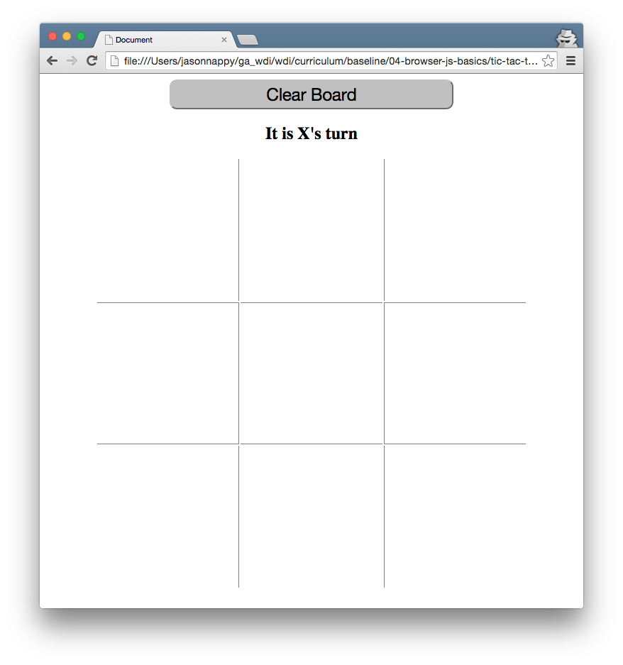
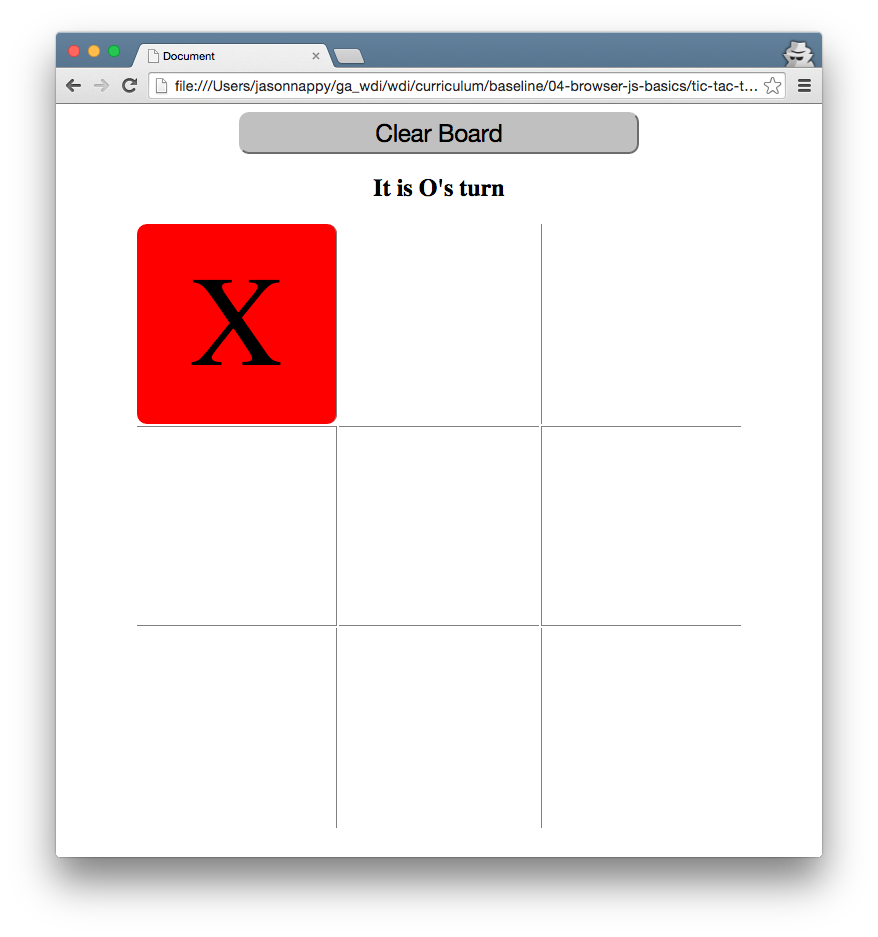
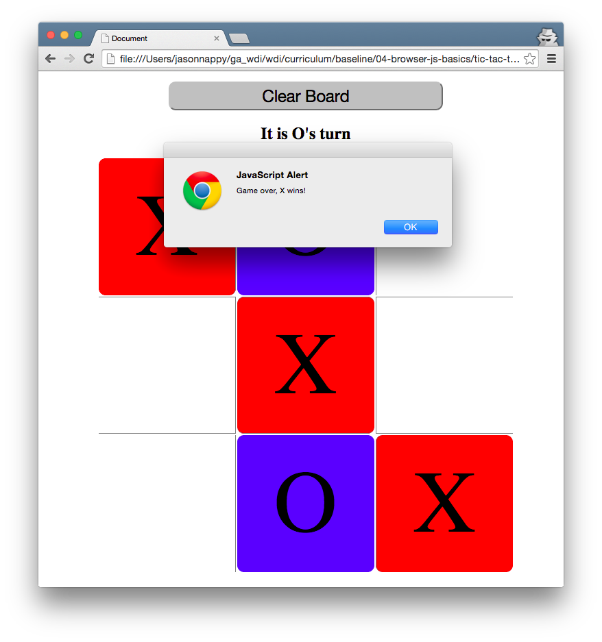

# Tic Tac Toe Lab

**Objective:** Build a tic tac toe game in HTML and JavaScript.

## Required Game components
* A user should be able to click on different squares to make a move.
* When a square is clicked, there should be visual feedback.
* Every click will alternate between being for Player 1 or Player 2. The visual feedback should indicate whose turn it is.
* A cell should not be able to be replayed once marked.
* Add a reset button that will clear the contents of the board.

## How to get started
1. Construct a `index.html` to be your starting point on this
   project. Add your necessary HTML tags, including `script` and
   `link` tags to link to your separate JavaScript and CSS files respectively.
2. Construct the gameboard. The gameboard page should include the 3x3 grid,
   and at minimum a reset button. Using `id` and `class` on clickable
   elements will help you wire this up in JavaScript afterwards.
3. JavaScript portion will be next:
	* Locate the element first to use it within your app. Think about
     using `querySelector` to locate your target elements.
     Try this in your console to make sure your selection works.
	* After finding the elements, start writing logic to listen for
      `click` events on those elements.
	* You will also need a variable to keep track of moves. As this
      will be used to indicate whether or not to draw an `X` or an `O`.

## Bonus
* Display a message to indicate which turn is about to be played.
* After the necessary moves have been played, stop game and alert the
  winner if one player ends up winning with three in a row.
    * Hint: Determine a set of winning combinations. Check those
      combinations on the board contents after every move.

## Ultra Bonus
* We once had a student implement an Artifical Intelligence (AI)
  opponent. If you really need a challenge, write some code that will
  play a game of Tic Tac Toe against you. (Hint: look into the minimax
  algorithm).

## Starter code

There is no starter code provided for this lab.

## Deliverable

Please find some screenshots of what you'll be creating.  Feel free to get creative with how you style your interface.

### Additional Resources

- [CSS-Tricks "What Is The DOM"](https://css-tricks.com/dom/)
- [More on events with Eloquent JavaScript](http://eloquentjavascript.net/14_event.html)
